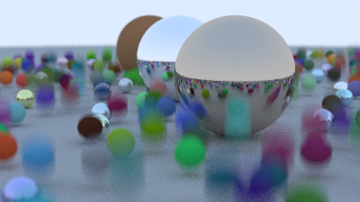

# [Ray Tracer the Next Week](https://github.com/gmath45/RaytracerNextWeek)

---

This is the next book in the series, expanding on the Ray Tracer build from the first. ([**Ray Tracing: The Next Week** - *Peter Shirley*, *Trevor David Black*, *Steve Hollasch*](https://raytracing.github.io/books/RayTracingTheNextWeek.html))

## Tools:
 - C++11
 - CMake
 - `stb_image_write.h`

## Products:
> ### [Blured Cover Image](src/cover_image_blur.cpp)
> ---
> - [`cover_image_blur.cpp`](src/cover_image_blur.cpp)
> 
> 

> ### [Bounding Volume Hierarchies](src/.cpp)
> ---
> - [`aabb.h`](src/aabb.h)
> - [`bvh.h`](src/bvh.h)
> - [`bvh.cpp`](src/bvh.cpp)
> 
> 

